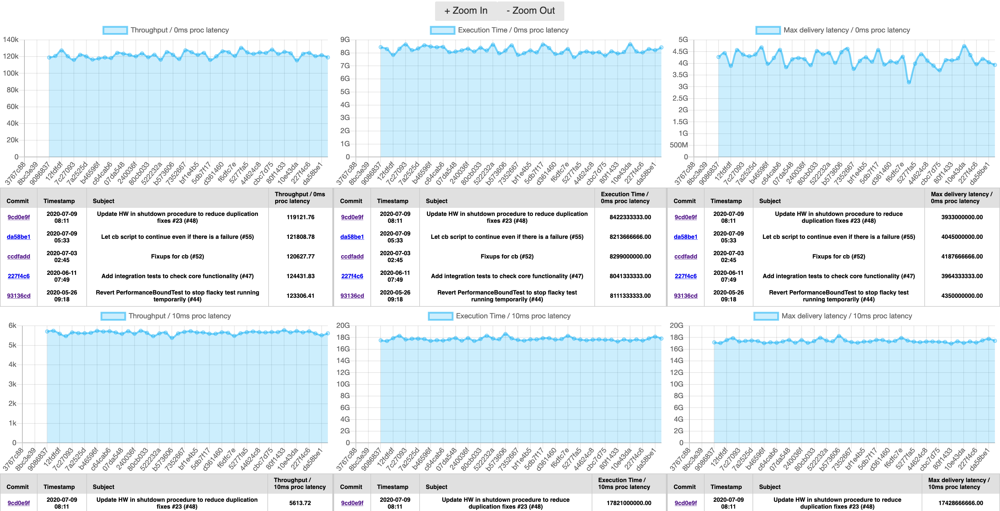

commits-loupe
=============

Standalone browser application for visualizing git commit's metadata.

You can embed charts of any values where's X-axis is commit IDs of your repository's target branch.


# Idea

As the project evolves many changes that we don't notice in regular build steps happens along with the code changes.
For example, despite many projects states "high performance" it is rare to see them maintaining a dashboard showing its actually measured performance commit-by-commit.
In contrast to 0/1 metrics like test failure, a typical software project contains many metrics that we can't simply juedge if its "good" or "bad", yet measuring important software performance which might not immediately indicates something but still worth to keep observing trend in relatively longer term.

One typical application of this idea is performance tracking. For every commit pushed into the repository you can automatically run some benchmarks, record the result as JSON and commit it into `gh-pages` branch.
Once the data is ready in somewhere accessible from your browser, commits-loupe takes care of the rest to render it as commit-by-commit transition chart.
[Decaton](https://github.com/line/decaton)'s [performance tracking dashboard](https://line.github.io/decaton) is a good example to see how it works.

Besides performance, you can apply the same technique for many other metrics as few examples listed below that might provides you some insights about your project's wellness.

* Decreasing *Test coverage* might indicates your project is getting complicated but the amount of test is not well caught up growth of your codebase.
* Increasing *Build time* might indicates that your project is getting more frustrating to be involved with and it's time to spend more resource on build optimization.
* Increasing *Lines of code* might indicates that your project size is growing fast without deprecated code cleaned up.

# Usage

Add below HTML/JS snippet to your HTML file.
```html
<script src="https://cdn.jsdelivr.net/gh/kawamuray/commits-loupe@VERSION/dist/commits-loupe.js"></script>
<script>
  commitsLoupe.ready(cloupe => {
      cloupe.create({
          on: "#loupe-screen", // <div> DOM selector to embed commits-loupe in your HTML
          repo: "line/decaton", // Your repository name on GitHub
          branch: "master", // Target branch
          data_url: "https://line.github.io/decaton/commit-data", // Base URL to serve commit data JSON
          components: {
              show_table: true,
              show_range: false,
          },
          data: [
              {
                  title: "Throughput / 0ms proc latency", // Chart title
                  file: "tasks_1000k_latency_0ms_concurrency_20-benchmark.json", // Name of the JSON file
                  query: "performance.throughput", // JMESPath query to scrape target value from JSON
              },
              ...
          ],
      });

      commitsLoupeStyle.initStyle();
  });
</script>
```

commits-loupe doesn't ship with any default style applied to let you adjust its style to be well blended with your site. If you want to apply least styling, add below snippet in addition to the basic snippet.

```html
<script src="https://cdn.jsdelivr.net/gh/kawamuray/commits-loupe@VERSION/dist/commits-loupe-style.js"></script    <script>
  commitsLoupe.ready(cloupe => {
      cloupe.create(...);
      commitsLoupeStyle.initStyle();
  });
</script>
```

# How it works

commits-loupe is a standalone in-browser application, so that it works well just by adding a `<script>` tag to load its js asset and a simple configuration describing data to show.
It requires only 2 external resource to access:

* API to list commits of the target repository/branch. This is offered by [GitHub's commits API](https://developer.github.com/v3/repos/commits/#list-commits).
* HTTP GET API to obtain per-topic data JSON. This could be placed anywhere, but in most cases you can just use [GitHub Pages](https://pages.github.com/).

1. When commits-loupe is loaded by your page, it tries to list commits in required range by calling GitHub commits API.
2. For each commit ID it could obtained, it GETs `configured-base-url/COMMIT_ID/configured-name.json`.
3. Scrape the value to render from obtained JSON by configured [JMESPath](https://jmespath.org/).
4. Render the chart with X-axis set to each commit ID.

# License

[MIT](./LICENSE)
